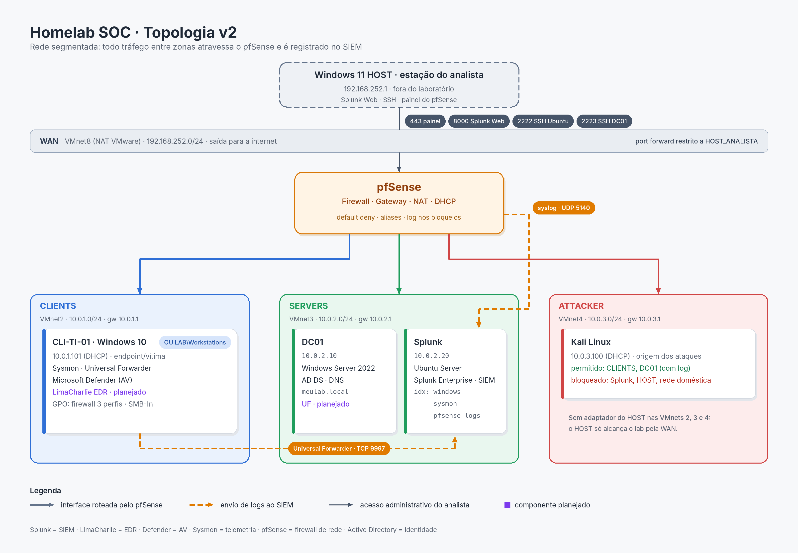

# Homelab SOC — SIEM, Active Directory e Segurança de Redes

Laboratório pessoal de cibersegurança construído para praticar o trabalho de um **analista SOC / Blue Team**: coleta e organização de logs em um SIEM, segmentação de rede, administração de Active Directory, troubleshooting por camadas e investigação de eventos com evidências.

O objetivo final é investigar incidentes observando várias camadas ao mesmo tempo:

**Identidade + Endpoint + Rede + SIEM + EDR**

---

## Arquitetura

```
                         ┌──────────────────────────────┐
                         │  Windows 11 HOST (analista)  │
                         │  Splunk Web · SSH · pfSense  │
                         └──────────────┬───────────────┘
                                        │ VMnet8 (WAN 192.168.252.0/24)
                              ┌─────────┴─────────┐
                              │      pfSense      │  firewall / gateway / NAT
                              └──┬───────┬──────┬─┘
                 CLIENTS         │       │      │        ATTACKER
              10.0.1.0/24 ───────┘       │      └─────── 10.0.3.0/24
              ┌────────────┐             │             ┌────────────┐
              │ WIN10      │             │             │ Kali Linux │
              │ CLI-TI-01  │      SERVERS 10.0.2.0/24  │ 10.0.3.100 │
              │ Sysmon, UF │     ┌───────┴────────┐    └────────────┘
              └────────────┘     │                │
                          ┌──────┴─────┐   ┌──────┴──────┐
                          │ DC01       │   │ Ubuntu      │
                          │ AD DS, DNS │   │ Splunk Ent. │
                          │ 10.0.2.10  │   │ 10.0.2.20   │
                          └────────────┘   └─────────────┘
```



Detalhes em [docs/arquitetura.md](docs/arquitetura.md).

| Componente | Função | Categoria |
|---|---|---|
| Windows 11 HOST | Estação do analista (não é alvo) | — |
| pfSense | Firewall, gateway, NAT, DHCP | Firewall de rede |
| Windows Server 2022 (DC01) | Active Directory, DNS (`meulab.local`) | Identidade |
| Windows 10 (CLI-TI-01) | Endpoint monitorado / vítima | Endpoint |
| Sysmon | Telemetria detalhada de processos, rede e registro | Telemetria de endpoint |
| Microsoft Defender | Antivírus | AV |
| LimaCharlie *(planejado)* | Detecção e resposta no endpoint | EDR |
| Ubuntu Server + Splunk Enterprise | Coleta, indexação, busca e correlação | SIEM |
| Splunk Universal Forwarder | Envio dos logs Windows ao Splunk | Coleta |
| Kali Linux | Origem de ataques simulados, em rede isolada | Atacante |

---

## Projetos

| # | Projeto | Competências demonstradas |
|---|---|---|
| 00 | [Topologia v1 → v2 e o erro 1789](projetos/00-topologia-v1-v2/) | Arquitetura de rede, DNS em AD, troubleshooting de domínio |
| 01 | [Segmentação da rede de ataque e política de menor privilégio](projetos/01-segmentacao-rede/) | Regras de firewall, aliases, IPv6, validação positiva e negativa |
| 02 | [Do timeout à GPO: diagnóstico de SMB entre segmentos](projetos/02-smb-troubleshooting-gpo/) | Packet capture, troubleshooting por camadas, OUs, GPO por PowerShell |
| 03 | [Onboarding de dados no Splunk](projetos/03-onboarding-splunk/) | index/sourcetype, Universal Forwarder, btool, canary event, macros |
| 04 | [Investigação de ruído de rede: hipótese errada, causa real](projetos/04-investigacao-ruido-rede/) | Análise de filterlog, mapeamento porta→processo, assinatura de código |

Os projetos 02 e 04 registram **hipóteses que se mostraram erradas** e como os dados levaram à conclusão correta. Isso é intencional: mostra o processo de investigação, não só o resultado.

---

## Tecnologias

Splunk Enterprise · Splunk Universal Forwarder · SPL · pfSense · Active Directory · Group Policy · DNS · Sysmon · Windows Defender Firewall · PowerShell · OpenSSH · tcpdump · Kali Linux · VMware Workstation

## Próximos passos

- Universal Forwarder no DC01 (camada de identidade: 4624, 4625, 4768, 4769, 4720) e auditoria avançada
- Coleta do Microsoft Defender e do log do Windows Firewall
- LimaCharlie (EDR) no WIN10 e integração com o Splunk
- Add-on de parsing do pfSense (src_ip, dest_ip, action)
- Cenários de ataque controlados com detecções documentadas (MITRE ATT&CK)

Acompanhamento detalhado em [PROGRESSO.md](PROGRESSO.md).

> Ambiente 100% isolado e controlado, construído para estudo. Nenhuma técnica aqui é usada contra sistemas de terceiros.
