# 00 — Topologia v1 → v2: da rede plana à segmentação

## Objetivo

Fazer com que todo o tráfego entre atacante, endpoint e servidores passe pelo firewall, para que possa ser **registrado, bloqueado e correlacionado** no SIEM.

## v1: o problema

- O pfSense tinha **2 interfaces**, e só o WIN10 ficava atrás dele.
- DC, Splunk, Kali e o HOST físico ficavam **na mesma rede** (VMnet8, NAT).
- O WIN10 saía pelo NAT do pfSense, então o DC via o **IP do pfSense como origem**, e não o do endpoint.
- A regra da LAN era "permitir tudo", e nada impedia o endpoint de alcançar o HOST.

| Problema | Impacto para um SOC |
|---|---|
| Tráfego leste-oeste (DC ↔ Kali ↔ Splunk) não passa pelo firewall | Ataques simulados sem rastro de rede |
| NAT esconde o IP do endpoint | Perda de correlação entre identidade (logon no DC) e rede |
| HOST na mesma rede das VMs | Uma VM comprometida alcança a estação do analista |

## v2: a solução

O pfSense passou a ter **4 interfaces**:

| Interface | Rede | VMnet | Ativos |
|---|---|---|---|
| WAN | DHCP (192.168.252.0/24) | VMnet8 | Saída para a internet, acesso do analista |
| CLIENTS | 10.0.1.0/24 | VMnet2 | WIN10 (CLI-TI-01) |
| SERVERS | 10.0.2.0/24 | VMnet3 | DC01 (10.0.2.10), Splunk (10.0.2.20) |
| ATTACKER | 10.0.3.0/24 | VMnet4 | Kali |

As redes internas **não têm adaptador no HOST**, que fica fora do laboratório e o acessa apenas pela WAN.

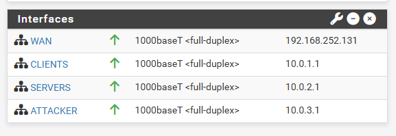

### Regras por interface (resumo)

| Interface | Política |
|---|---|
| CLIENTS | Libera apenas o necessário para o domínio (DNS, Kerberos, LDAP, SMB, RPC) e o envio de logs (TCP 9997); bloqueia RFC1918 com log; libera web (80/443); bloqueia o resto com log |
| SERVERS | Libera DNS no pfSense, NTP e web para atualizações; bloqueia RFC1918 e o resto, com log |
| ATTACKER | Alcança CLIENTS e o DC (com log); nunca o Splunk, o HOST ou a rede doméstica |
| WAN | O HOST acessa só o painel (443), o Splunk Web (8000) e o SSH (2222), por port forward com origem restrita |

### Decisões de projeto

1. **Aliases** (`DC`, `SPLUNK`, `RFC1918`, `WEB`...) para regras legíveis e documentáveis.
2. **Log nas regras de bloqueio**, gerando eventos `block` que alimentam detecções.
3. **HOST fora das redes internas**, reduzindo o risco de uma VM comprometida alcançá-lo.
4. **Caminho de DNS único:** WIN10 → DC → pfSense, sem resolvedores públicos nos clientes.

### Validação da migração

| Teste | Resultado |
|---|---|
| DC e Splunk alcançam o pfSense | ✅ |
| WIN10 resolve `meulab.local` e encontra o DC (`nltest`) | ✅ |
| HOST acessa Splunk Web e SSH pelo port forward | ✅ |
| Eventos do WIN10 e do pfSense chegando ao Splunk | ✅ |

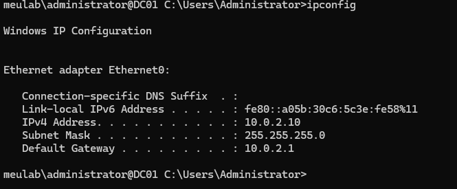
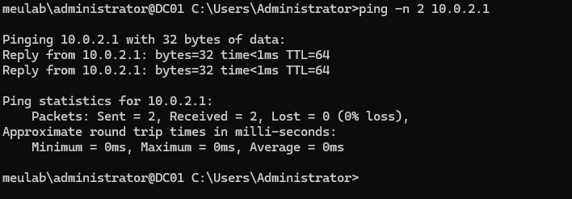
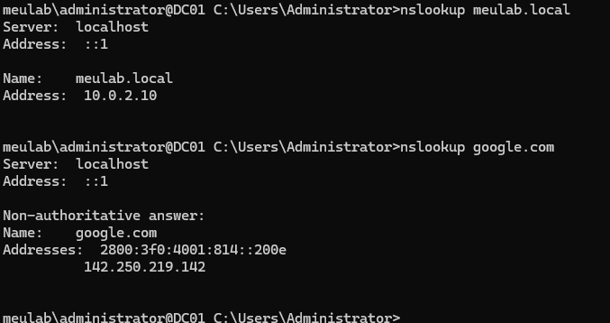
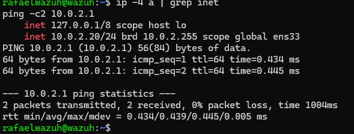
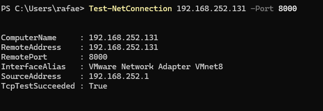
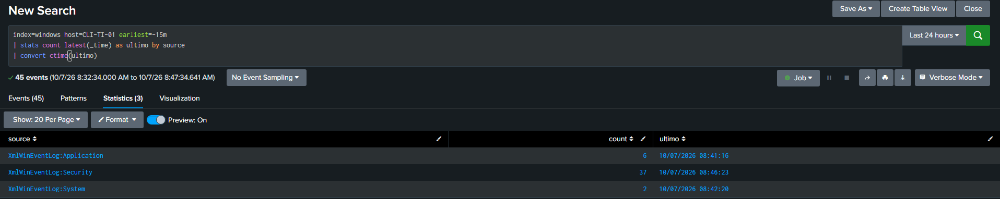
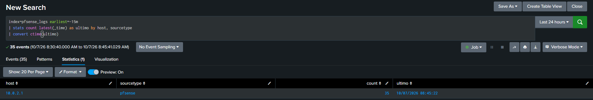

---

## Caso de troubleshooting: erro 1789 depois de mover o DC

### Cenário

- DC movido de `192.168.252.10` para `10.0.2.10` (rede SERVERS, atrás do pfSense).
- Cliente `CLI-TI-01` (10.0.1.101), ingressado em `meulab.local`, em outro segmento.

### Sintomas

| Sintoma | Onde |
|---|---|
| `nslookup meulab.local` com timeout para `192.168.252.10` | Cliente |
| `net localgroup Administradores` → **erro de sistema 1789** (falha na relação de confiança) | Cliente |
| UAC: "o domínio não está disponível" ao usar credenciais de domínio | Cliente |
| `ping 10.0.2.10` respondendo normalmente | Cliente |

O ping funcionando descartou problema de rota e de firewall.

### Diagnóstico

1. `ping` ao DC OK → rede e regras do pfSense corretas.
2. `ipconfig /all` mostrou **DHCP habilitado**, mas DNS `192.168.252.10`.
3. O pfSense já entregava `10.0.2.10` por DHCP, então o valor antigo estava **fixado manualmente** na placa.
4. Com o DNS apontando para um IP que não existe mais, o cliente não localizava o DC (registros SRV) nem validava o canal seguro.

### Correção

**Temporária** (sem acesso administrativo ao cliente, já que as credenciais de domínio não funcionavam): port forward na interface CLIENTS do pfSense, redirecionando DNS (TCP/UDP 53) de `192.168.252.10` para `10.0.2.10`.

Resultado: `nslookup meulab.local` resolveu e `nltest /dsgetdc:meulab.local` listou o DC01.

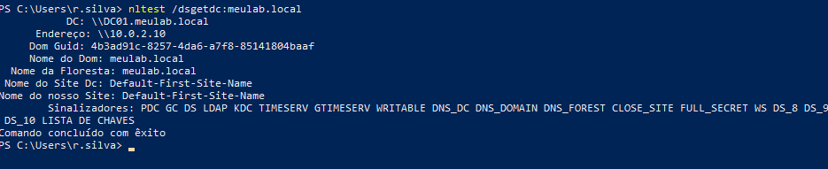

**Definitiva:** com o domínio acessível, uma conta administrativa passou a ser aceita e o DNS voltou ao automático:

```cmd
netsh interface ip set dns name="Ethernet0" source=dhcp
ipconfig /renew
ipconfig /flushdns
```

Depois, o redirecionamento temporário foi **removido**.

### Validação

```text
nslookup meulab.local            -> 10.0.2.10 (servidor também 10.0.2.10)
nltest /dsgetdc:meulab.local     -> DC01, sinalizadores PDC GC DS KDC DNS_DC
nltest /sc_verify:meulab.local   -> NERR_Success (canal seguro saudável)
```

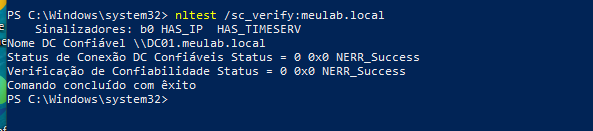
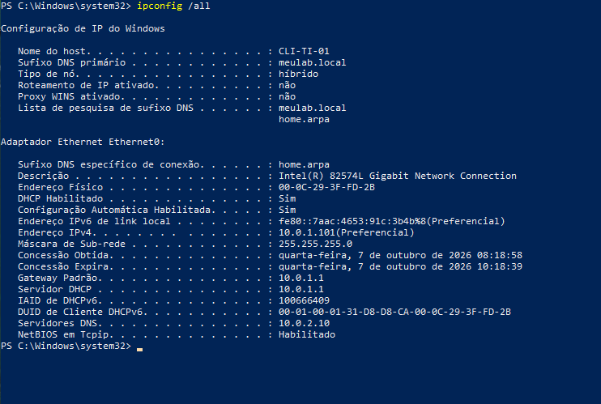

---

## O que foi aprendido

- Segmentar é o que transforma o firewall em **fonte de telemetria**.
- **Active Directory depende de DNS.** Ao mudar o IP de um DC, revise todo cliente com DNS fixo.
- Um ping funcionando **não** prova que o domínio está saudável: teste resolução de nomes e canal seguro.
- `DHCP habilitado` não garante DNS automático: o Windows aceita IP por DHCP com DNS manual.
- O firewall pode servir de **remendo temporário** para recuperar acesso, mas o remendo precisa ser removido.
- Mover um serviço exige atualizar **tudo** que aponta para o IP antigo (forwarder, syslog, DNS).
- Um erro no alias `RFC1918` (`/32` em vez de `/12`) abriria uma brecha nas regras de bloqueio.
- Um intervalo de portas `80`–`443` libera todas as portas entre elas; use alias de porta.
- O bloqueio de redes privadas na WAN do pfSense precisa ser desativado para o HOST (rede privada) acessar o painel.
- Nomes de grupo mudam com o idioma do Windows (`Administradores` em vez de `Administrators`).

## Limitações

- WAN do pfSense recebe IP por DHCP do VMware (pode mudar).
- Um único DC, sem redundância.
- Inventário de contas administrativas locais ainda não formalizado (senhas a guardar em gerenciador).

> Os prints do estado com problema (nslookup com timeout e DNS fixo no IP antigo) não foram preservados; as saídas estão descritas em texto acima.
