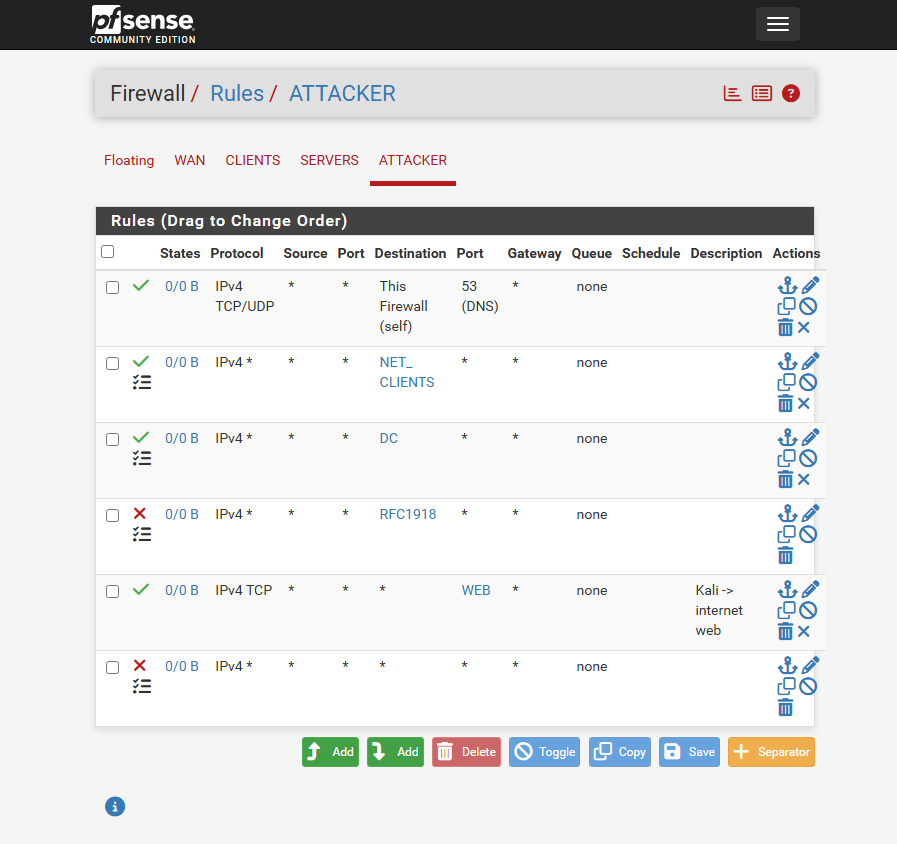
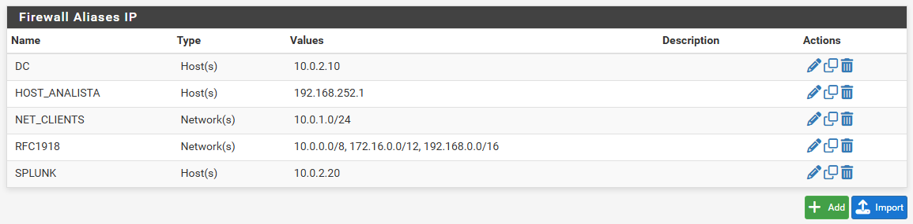
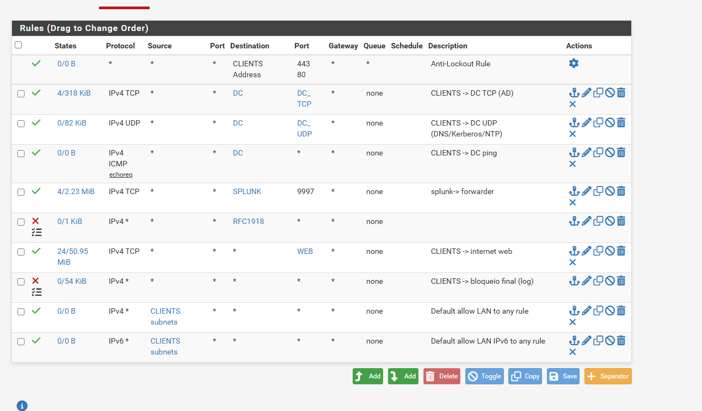
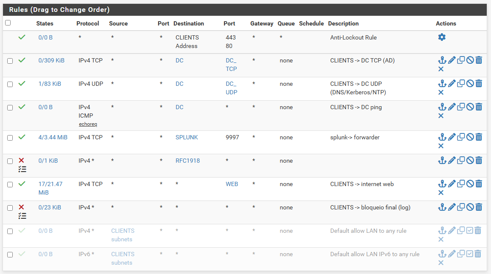
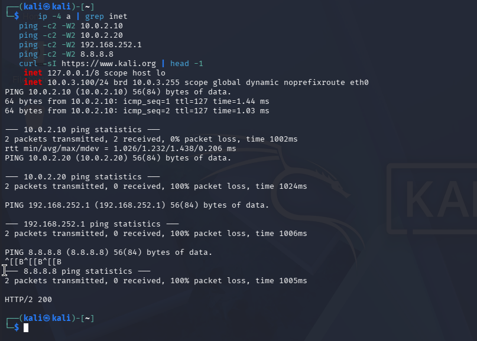
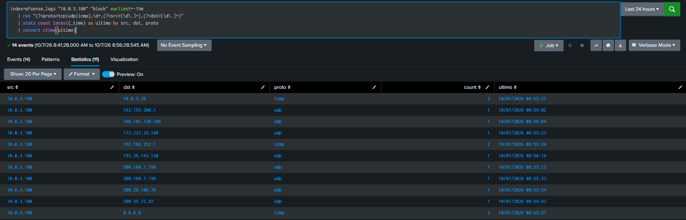

# 01 — Segmentação da rede de ataque e política de menor privilégio

## Objetivo

1. Isolar a máquina de ataque (Kali) em um segmento próprio, sem acesso ao HOST nem ao SIEM.
2. Substituir as regras "permitir tudo" da rede de clientes por uma política **default deny** com exceções explícitas.

## Cenário

Antes desta etapa, o Kali estava na VMnet8 (mesma rede da WAN do pfSense) e conseguia alcançar o Windows 11 HOST. A rede CLIENTS ainda tinha as regras padrão **Default allow LAN to any** (IPv4 e IPv6).

## Por que isso importa em um SOC

- O atacante não pode alcançar o **SIEM**: um invasor com acesso ao Splunk poderia apagar ou poluir evidências.
- Todo ataque simulado deve **atravessar o firewall**, gerando log de rede para correlacionar com o log do endpoint.
- Um endpoint comprometido deve alcançar apenas o que precisa (menor privilégio aplicado à rede).

## Configuração

### Rede ATTACKER (VMnet4)

- Host-only, **sem adaptador virtual do HOST**, sem DHCP do VMware.
- DHCP do pfSense (10.0.3.100–150), DNS = 10.0.3.1.


### Regras da interface ATTACKER (ordem de avaliação: de cima para baixo, primeira que casa vence)

| # | Ação | Destino | Porta | Motivo |
|---|---|---|---|---|
| 1 | Pass | This Firewall | 53 | DNS |
| 2 | Pass (log) | NET_CLIENTS | * | Alvo dos ataques |
| 3 | Pass (log) | DC | * | Ataques de identidade (Kerberos, LDAP) |
| 4 | Block (log) | RFC1918 | * | Protege HOST, SIEM e painel do firewall |
| 5 | Pass | * | WEB (80, 443) | Atualizações do Kali |
| 6 | Block (log) | * | * | Bloqueio final com registro |




### Rede CLIENTS: remoção das regras permissivas

Estado antes da mudança:



Análise das regras existentes revelou dois problemas:

| Regra | Problema |
|---|---|
| Default allow IPv4 | **Regra sombreada** (*shadowed*): ficava abaixo do bloqueio final IPv4, nunca era avaliada (contador 0/0 B) |
| Default allow IPv6 | **Bypass real**: o bloqueio final era só IPv4, então qualquer tráfego IPv6 passaria livre |

As duas foram **desativadas** (não excluídas, para permitir rollback). A política resultante:

| Destino | Permitido |
|---|---|
| DC | TCP/UDP de AD, DNS, Kerberos, NTP; ICMP |
| Splunk | TCP 9997 (Universal Forwarder) |
| Demais redes internas (RFC1918) | Bloqueado com log |
| Internet | Somente WEB (80/443) |
| Resto | Bloqueado com log |



## Validação

### Isolamento do Kali (testes positivos e negativos)

| Teste | Esperado | Resultado |
|---|---|---|
| DNS via 10.0.3.1 | OK | ✅ Resolveu |
| Ping DC 10.0.2.10 | OK | ✅ TTL=127 |
| Ping Splunk 10.0.2.20 | Bloqueado | ✅ 100% loss |
| Ping HOST 192.168.252.1 | Bloqueado | ✅ 100% loss |
| Ping gateway 10.0.3.1 | Bloqueado (ICMP cai na regra RFC1918) | ✅ 100% loss |
| Ping 8.8.8.8 | Bloqueado (só web liberado) | ✅ 100% loss |
| `curl -I https://www.kali.org` | OK | ✅ HTTP/2 200 |

```text
┌──(kali㉿kali)-[~]
└─$ ping -c2 10.0.2.10
64 bytes from 10.0.2.10: icmp_seq=1 ttl=127 time=1.06 ms
64 bytes from 10.0.2.10: icmp_seq=2 ttl=127 time=1.00 ms

└─$ ping -c2 192.168.252.1
2 packets transmitted, 0 received, 100% packet loss, time 1000ms

└─$ curl -I https://www.kali.org
HTTP/2 200
```

> **Leitura do TTL=127:** o Windows envia TTL inicial 128; o pfSense subtraiu 1 ao rotear. Só pelo TTL dá para inferir o sistema operacional e a distância em saltos.



### Evidência no SIEM

```spl
index=pfsense_logs "10.0.3.100" block earliest=-15m
| table _time _raw
```



### CLIENTS após a mudança

```text
PS C:\Users\r.silva> nltest /dsgetdc:meulab.local
           DC: \\DC01.meulab.local
      Endereço: \\10.0.2.10
Comando concluído com êxito

PS C:\Users\r.silva> nslookup google.com
Address:  10.0.2.10
Addresses:  142.250.219.142
```

O domínio e o DNS continuaram funcionando sem as regras permissivas.

## Resultado

- Atacante isolado: alcança apenas os alvos definidos, e toda tentativa fora disso é **bloqueada e registrada**.
- Rede de clientes sob política de menor privilégio, sem bypass por IPv6.

## O que foi aprendido

- **Regras sombreadas** são um item clássico de auditoria de firewall: regras mortas confundem quem lê a política.
- **IPv6 esquecido** é um ponto cego comum: um bloqueio só IPv4 não protege tráfego IPv6.
- Validar segmentação exige **testes negativos** (o que deve falhar) e evidência no SIEM, não só "o ping falhou".
- Desativar em vez de excluir permite rollback rápido.

## Limitações e melhorias

- A **Anti-Lockout Rule** ainda permite que a rede CLIENTS acesse o painel do pfSense. Próximo passo: desativá-la, já que a administração é feita pela WAN a partir do HOST.
- Sem DNS reverso para as redes internas (`nslookup` mostra `Servidor: UnKnown`).
- Origem das regras como `*`; restringir a "ATTACKER subnets" reforça proteção contra spoofing.
