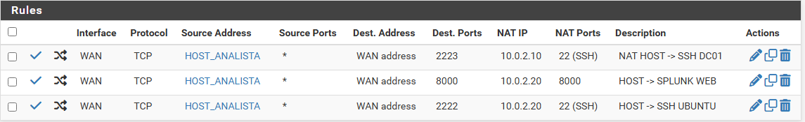
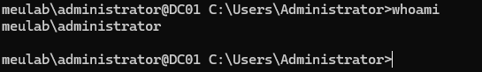
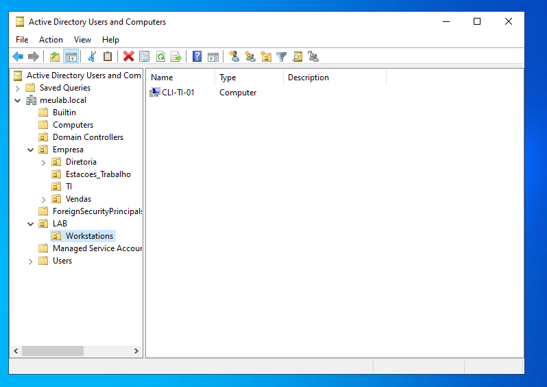
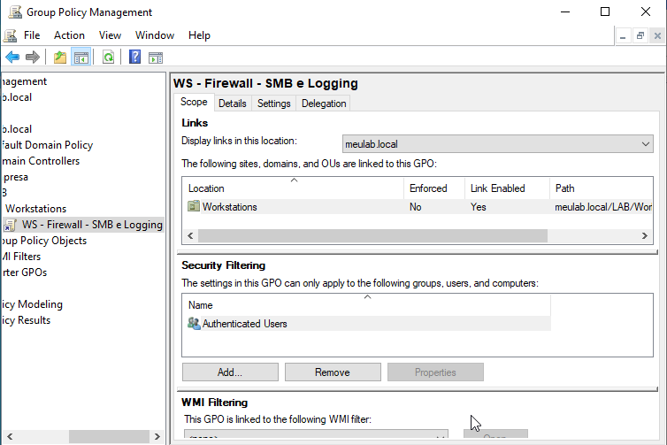
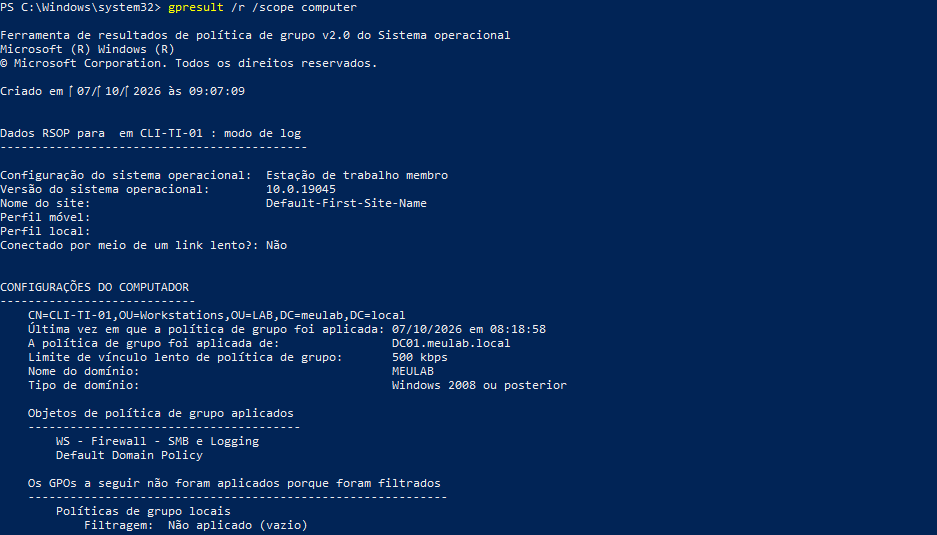
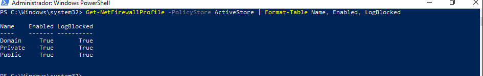

# 02 — Do timeout à GPO: diagnóstico de SMB entre segmentos

## Objetivo

Descobrir por que o Kali (rede ATTACKER) não conseguia alcançar o SMB (TCP 445) do WIN10 (rede CLIENTS), mesmo com a regra de firewall permitindo, e corrigir de forma **centralizada**, como em uma empresa.

## Cenário

O SMB aberto nas estações é comum em ambientes corporativos e é o que ataques de **movimento lateral** exploram. Para simular esses ataques e gerar telemetria (4624 tipo 3, 4625, 5140, conexões no Sysmon), o WIN10 precisa responder na porta 445.

## Investigação

### 1. Sintoma

```text
└─$ ping -c2 10.0.1.101
2 packets transmitted, 0 received, 100% packet loss

└─$ nc -zv -w3 10.0.1.101 445
(UNKNOWN) [10.0.1.101] 445 (microsoft-ds) : Connection timed out
```

`timed out` = descarte silencioso. Dois suspeitos: o **pfSense** ou o **firewall do Windows**.

### 2. Isolando por camadas: packet capture no ponto intermediário

Captura na interface CLIENTS do pfSense, filtro `host 10.0.1.101 and port 445`:

```text
tcpdump -ni em1 '((host 10.0.1.101) and (port 445)) and ((not vlan))'

22:58:14.693419 IP 10.0.3.100.56512 > 10.0.1.101.445: tcp 0
22:58:15.700563 IP 10.0.3.100.56512 > 10.0.1.101.445: tcp 0
22:58:16.724300 IP 10.0.3.100.56512 > 10.0.1.101.445: tcp 0
```

Leitura:
- Os pacotes **saíram pela interface CLIENTS** → o pfSense permitiu.
- `tcp 0` = SYN sem dados; 3 retransmissões espaçadas de ~1 s.
- **Nenhuma resposta** do WIN10 (nem SYN-ACK, nem RST).

### 3. Uma variável nova: o endpoint estava hibernando

Descobri que o WIN10 estava **hibernando** durante o teste. Isso invalidava a conclusão: o silêncio poderia ser só "ninguém para responder" (o pfSense ainda tinha o MAC em cache ARP).

**O teste foi refeito** com o WIN10 ativo:

```text
23:09:23.278722 IP 10.0.3.100.52918 > 10.0.1.101.445: tcp 0
23:09:24.307983 IP 10.0.3.100.52918 > 10.0.1.101.445: tcp 0
23:09:25.332344 IP 10.0.3.100.52918 > 10.0.1.101.445: tcp 0
```

Mesmo resultado, agora com o host acordado e o perfil de firewall confirmado:

```text
PS> Get-NetFirewallProfile | Format-Table Name, Enabled
Domain     True
Private   False
Public    False

PS> Get-NetConnectionProfile | Format-Table InterfaceAlias, NetworkCategory
Ethernet0      DomainAuthenticated
```

**Conclusão comprovada:** o pfSense permite; o **Windows Defender Firewall** (perfil Domain) descarta o SMB de entrada.

Achado lateral: os perfis **Private e Public estavam desligados**. Se o WIN10 perdesse contato com o DC, a rede cairia no perfil Public, **sem firewall nenhum**.

## Correção: GPO, não configuração local

Em empresas, o firewall das estações é gerenciado centralmente. A correção foi feita por **Group Policy**.

### Acesso administrativo ao DC por SSH

Para administrar o DC a partir da estação do analista: OpenSSH Server no DC01 e port forward no pfSense (WAN:2223 → 10.0.2.10:22), **restrito ao alias `HOST_ANALISTA`**.




### Organização do AD em OUs

O computador estava no contêiner padrão `CN=Computers`, que **não aceita vínculo de GPO**.

```powershell
New-ADOrganizationalUnit -Name "LAB" -Path "DC=meulab,DC=local"
New-ADOrganizationalUnit -Name "Workstations" -Path "OU=LAB,DC=meulab,DC=local"
Get-ADComputer CLI-TI-01 | Move-ADObject -TargetPath "OU=Workstations,OU=LAB,DC=meulab,DC=local"
```

```text
DistinguishedName
-----------------
CN=CLI-TI-01,OU=Workstations,OU=LAB,DC=meulab,DC=local
```



### GPO criada inteiramente por PowerShell

```powershell
$gpo   = "WS - Firewall - SMB e Logging"
$store = "meulab.local\$gpo"
New-GPO -Name $gpo -Comment "Libera SMB-In no perfil Domain, liga os 3 perfis e ativa log de pacotes descartados"
New-GPLink -Name $gpo -Target "OU=Workstations,OU=LAB,DC=meulab,DC=local"

Set-NetFirewallProfile -PolicyStore $store -Profile Domain,Private,Public -Enabled True `
  -LogBlocked True -LogMaxSizeKilobytes 16384 `
  -LogFileName "%systemroot%\system32\LogFiles\Firewall\pfirewall.log"

New-NetFirewallRule -PolicyStore $store -DisplayName "LAB - SMB-In (Domain)" `
  -Direction Inbound -Protocol TCP -LocalPort 445 -Profile Domain -Action Allow
```

A GPO faz três coisas:
1. Libera **TCP 445 só no perfil Domain**.
2. **Liga os três perfis** do firewall (corrige o achado lateral).
3. Ativa o **log de pacotes descartados** (futura fonte para o Splunk).



## Validação

```powershell
gpupdate /force
gpresult /r /scope computer
Get-NetFirewallProfile -PolicyStore ActiveStore | Format-Table Name, Enabled, LogBlocked
```




> **Armadilha encontrada:** `Get-NetFirewallProfile` sem parâmetros mostra a configuração **local**, não a **efetiva**. Os perfis apareciam `False` localmente enquanto a GPO os ligava. O estado real se vê com `-PolicyStore ActiveStore`.

```text
└─$ nc -zv -w3 10.0.1.101 445
(UNKNOWN) [10.0.1.101] 445 (microsoft-ds) open
```


## Resultado

| | Antes | Depois |
|---|---|---|
| SMB do Kali → WIN10 | Timeout (descarte no host) | `open` |
| Perfis do firewall | Só Domain ligado | 3 perfis ligados (efetivo) |
| Log de descartes | Desligado | Ligado (`pfirewall.log`) |
| Gestão | Local | GPO na OU `LAB\Workstations` |

## O que foi aprendido

- **Troubleshooting por camadas:** uma captura no ponto intermediário separa "problema de rede" de "problema no host".
- **Refazer o teste quando surge uma variável nova** (hibernação) evitou uma conclusão sem prova.
- Contas de computador terminam com `$` (`CLI-TI-01$`) e aparecem assim nos logs de logon.
- Contêineres (`CN=`) não aceitam GPO; OUs (`OU=`) sim.
- Configuração local ≠ política ≠ estado efetivo.
- Desligar o **antivírus** Defender não desliga o **firewall** Defender: são componentes diferentes.

## Limitações e melhorias

- Administração do DC com a conta `administrator` padrão. Em empresas: conta administrativa separada e estação dedicada (PAW).
- O `sshd` do DC estava com inicialização **Manual** e parou após reiniciar; corrigido para Automatic. Lição: validar persistência após reboot.
- Próximo passo: coletar o `pfirewall.log` no Splunk e desativar a hibernação do WIN10 por GPO (hibernação = buraco de telemetria).
