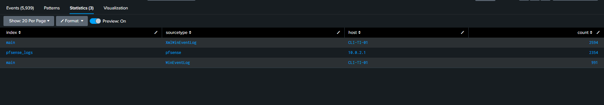
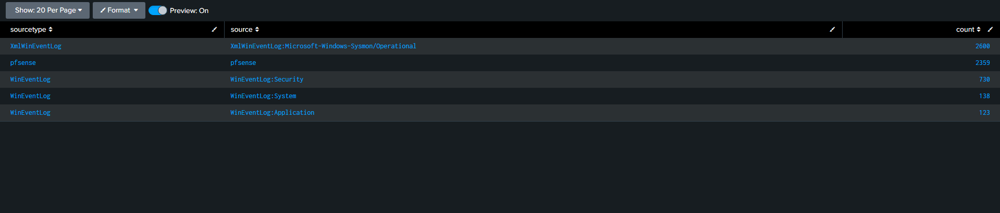
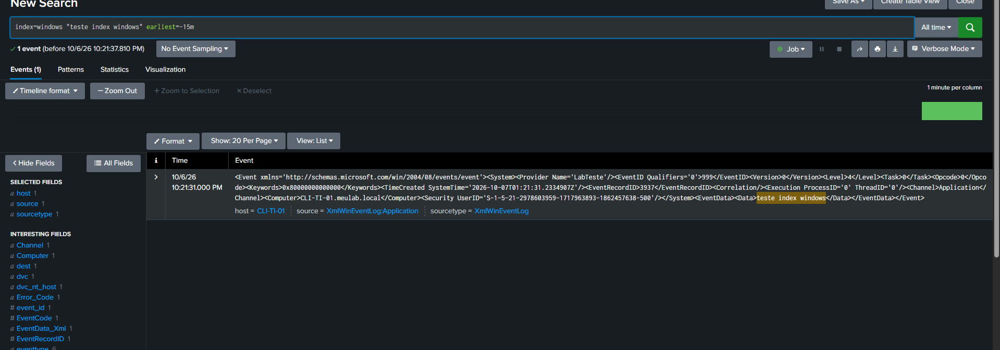
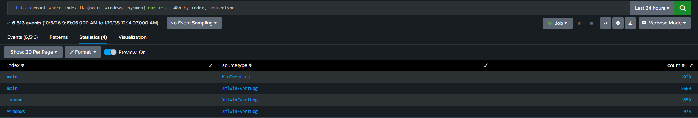
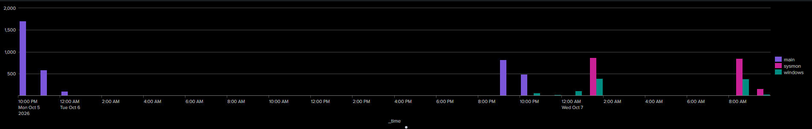
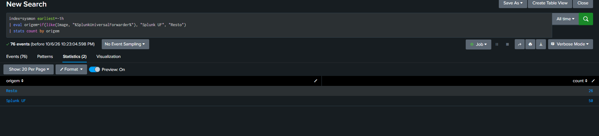
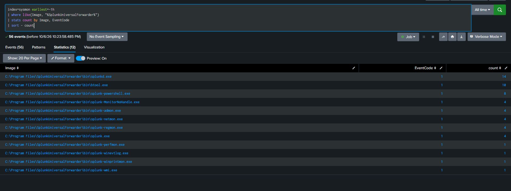
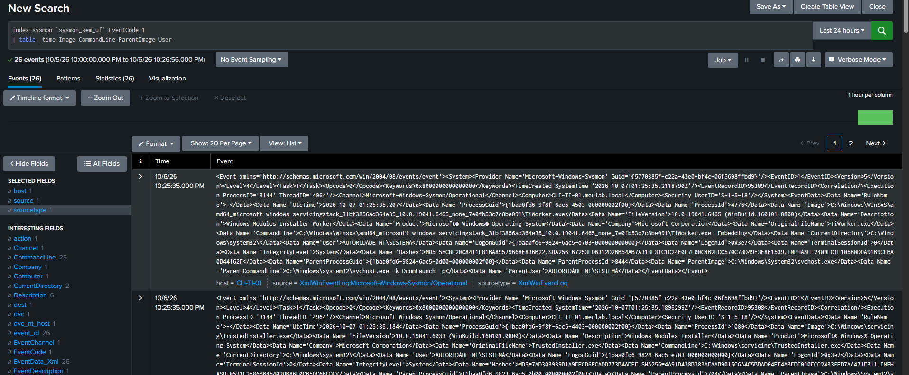
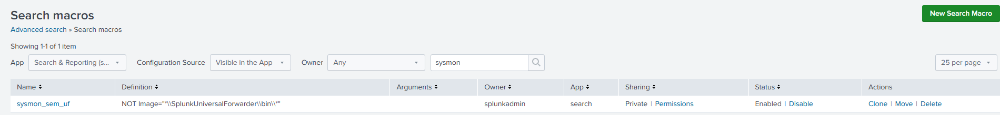
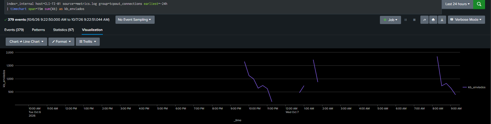

# 03 — Onboarding de dados no Splunk

## Objetivo

Reorganizar a coleta de logs do Splunk: tirar os dados do index padrão, padronizar o formato dos eventos Windows e tratar o ruído sem criar pontos cegos.

## Conceitos usados

| Campo | O que é | Exemplo |
|---|---|---|
| **index** | Onde os eventos ficam guardados; define retenção e permissões | `sysmon` |
| **sourcetype** | Formato do dado; diz como interpretar e extrair campos | `XmlWinEventLog` |
| **source** | De onde veio dentro da máquina (canal, arquivo, porta) | `XmlWinEventLog:Security` |
| **host** | Qual máquina gerou o evento | `CLI-TI-01` |

## 1. Inventário: o que chegava

```spl
| tstats count where index=* by index, sourcetype, host
```

| index | sourcetype | host | Problema |
|---|---|---|---|
| main | XmlWinEventLog | CLI-TI-01 | Sysmon no index padrão |
| main | WinEventLog | CLI-TI-01 | Security/System/Application no index padrão, formato clássico |
| pfsense_logs | pfsense | 10.0.2.1 | OK |




Achados:
- **Não havia duplicação**, e sim **inconsistência**: Sysmon em XML, os demais canais em formato clássico.
- Dados Windows no `main` (sem retenção ou permissões próprias).

O `tstats` lê apenas metadados indexados, por isso é a forma rápida de fazer inventário.

## 2. Decisão de arquitetura

| Index | Conteúdo | Decisão |
|---|---|---|
| `windows` | Security, System, Application | Criar |
| `sysmon` | Sysmon/Operational | Criar (alto volume, uso de hunting, retenção própria) |
| `pfsense_logs` | Firewall | Manter (o Splunk não renomeia indexes) |

Critério: **separar por retenção e acesso**, não por tipo de log.

```bash
sudo /opt/splunk/bin/splunk add index windows
sudo /opt/splunk/bin/splunk add index sysmon
```

O index precisa existir **antes** do forwarder enviar dados; caso contrário, os eventos são descartados.

## 3. Diagnóstico da configuração do forwarder

`btool` mostra a configuração **efetiva** e de qual arquivo vem cada linha:

```powershell
.\splunk btool inputs list --debug | Select-String "\\local\\"
```

```text
...\apps\SplunkUniversalForwarder\local\inputs.conf  [WinEventLog://Security]     (sem index, sem renderXml)
...\apps\SplunkUniversalForwarder\local\inputs.conf  [WinEventLog://System]
...\apps\SplunkUniversalForwarder\local\inputs.conf  [WinEventLog://Application]
...\system\local\inputs.conf                         [WinEventLog://Microsoft-Windows-Sysmon/Operational]
...\system\local\inputs.conf                         index = main
...\system\local\inputs.conf                         renderXml = 1
```

A configuração estava espalhada em dois arquivos: um criado pelo instalador e outro adicionado à mão.

O mesmo `btool` confirmou que o `outputs.conf` tinha um único destino (`10.0.2.20:9997`), sem resquício do IP antigo do Splunk.

## 4. App de configuração próprio

Em vez de editar `system\local`, toda a coleta passou para um app (`lab_inputs_windows`), que é o modelo usado com Deployment Server em empresas.

```ini
# etc\apps\lab_inputs_windows\local\inputs.conf
[WinEventLog://Security]
disabled = 0
index = windows
renderXml = 1

[WinEventLog://System]
disabled = 0
index = windows
renderXml = 1

[WinEventLog://Application]
disabled = 0
index = windows
renderXml = 1

[WinEventLog://Microsoft-Windows-Sysmon/Operational]
disabled = 0
index = sysmon
renderXml = 1
```

Os arquivos antigos foram renomeados para `.bak`. Isso era obrigatório: `system\local` **tem precedência sobre apps**, e o `index = main` antigo continuaria vencendo.

## 5. Validação com canary event

Injetar um evento conhecido e confirmar que ele chega:

```powershell
eventcreate /T INFORMATION /ID 999 /L APPLICATION /SO LabTeste /D "teste index windows"
```

```spl
index=windows "teste index windows"
```

Resultado: `index=windows`, `sourcetype=XmlWinEventLog`, `source=XmlWinEventLog:Application`, com o `UserID` terminando em **-500** (Administrator embutido) mostrando quem gerou o evento.





## 6. Ruído do forwarder no Sysmon: medir antes de cortar

```spl
index=sysmon earliest=-1h
| eval origem=if(like(Image, "%SplunkUniversalForwarder%"), "Splunk UF", "Resto")
| stats count by origem
```

| origem | count |
|---|---|
| Splunk UF | 50 |
| Resto | 26 |



Cerca de 66% do Sysmon era o próprio forwarder. Detalhando:

```spl
index=sysmon earliest=-1h
| where like(Image, "%SplunkUniversalForwarder%")
| stats count by Image, EventCode
```



- **100% era EventCode 1** (criação de processo).
- `btool.exe` e `splunk.exe` = a **minha própria administração** durante a sessão.
- `splunk-admon`, `-netmon`, `-regmon`, `-wmi`... = módulos disparados no **restart** do forwarder.

**Decisão:** não excluir na origem. A amostra estava enviesada, e excluir EventID 1 do forwarder criaria um **ponto cego** (perderia a visibilidade de alguém mexendo no agente de coleta). Exclusões amplas por caminho (`contains`) também são exploráveis por atacantes.

Filtro aplicado **na busca**, via macro:

| Macro | Definição |
|---|---|
| `sysmon_sem_uf` | `NOT Image="*\\SplunkUniversalForwarder\\bin\\*"` |

```spl
index=sysmon `sysmon_sem_uf` EventCode=1
| table _time Image CommandLine ParentImage User
```

Validação: a macro retornou 26 eventos, exatamente o "Resto" da medição.





### Triagem de exemplo

O primeiro resultado foi `TiWorker.exe`. Checklist de masquerading (MITRE T1036):

| Pergunta | Valor | Leitura |
|---|---|---|
| Caminho | `C:\Windows\WinSxS\...` | Legítimo |
| Pai | `svchost.exe -k DcomLaunch` | Esperado |
| Usuário | NT AUTHORITY\SYSTEM | Esperado |
| Metadados | Microsoft Windows | Coerente |

Veredito: Windows Update (benigno).

## 7. Saúde da coleta

```spl
index=_internal host=CLI-TI-01 source=*metrics.log group=tcpout_connections
| timechart span=5m sum(kb) as kb_enviados
```

Um forwarder que para de enviar é um ponto cego. Buracos no gráfico correspondem a períodos sem telemetria (como a hibernação observada no projeto 02).



## Resultado

| | Antes | Depois |
|---|---|---|
| Index dos dados Windows | `main` | `windows` / `sysmon` |
| Formato | XML e clássico misturados | `XmlWinEventLog` em tudo |
| Configuração | 2 arquivos, `system\local` | 1 app dedicado |
| Ruído do forwarder | Em todas as buscas | Macro, sem perda de dados |

## O que foi aprendido

- `btool` é o equivalente do "estado efetivo": mostra qual camada de configuração vence.
- Canary events são a forma padrão de validar um pipeline de coleta.
- Medir antes de filtrar; uma amostra coletada durante a administração é enviesada.
- O Splunk não move dados entre indexes: o histórico fica no `main` (`index IN (main, windows)` durante a transição).
- O Windows grava horário em UTC; o Splunk exibe no fuso do usuário.

## Próximos passos

- Medir o ruído do Sysmon em regime normal (`timechart span=5m count by EventCode`).
- Add-on do pfSense para extrair `src_ip`, `dest_ip`, `action`.
- Definir retenção por index.
- Remover o index antigo `pfsense` após verificar o conteúdo.
