# 04 — Investigação de ruído de rede: hipótese errada, causa real

## Objetivo

Eliminar dos logs do firewall um broadcast que gerava um bloqueio a cada ~10 segundos na WAN do pfSense, **sem criar ponto cego** e sem silenciar algo que não foi identificado.

## Cenário

Nos logs do pfSense no Splunk, um fluxo constante:

```text
UDP 192.168.252.1 → 255.255.255.255:12345   (bloqueado na WAN)
```

`192.168.252.1` é o Windows 11 HOST na VMnet8. A hipótese inicial, registrada em sessão anterior, era **"broadcast do VMware"**.

## Investigação

### 1. Identificar antes de suprimir

Silenciar tráfego desconhecido é exatamente como um comportamento malicioso passa despercebido. Mapeamento porta → processo no HOST:

```powershell
Get-NetUDPEndpoint -LocalPort 12345 |
  Select-Object LocalAddress, LocalPort, OwningProcess,
    @{n="Processo";e={(Get-Process -Id $_.OwningProcess).Path}}
```

```text
LocalAddress  LocalPort OwningProcess Processo
192.168.252.1     12345         13952 C:\Users\<usuario>\AppData\Local\VortxEngine\app-2.5.74\Signal-x64\SignalRgb.exe
192.168.x.x       12345         13952 ...\SignalRgb.exe
0.0.0.0           12345         13952 ...\SignalRgb.exe
```

**Hipótese descartada:** não era o VMware, e sim o **SignalRGB**, software de iluminação RGB que faz descoberta de dispositivos em todas as interfaces de rede.

### 2. Validar a legitimidade

O executável roda de `AppData\Local`, pasta gravável pelo usuário e muito usada por malware. O caminho sozinho não prova nada, então foi verificada a assinatura:

```powershell
Get-AuthenticodeSignature "...\SignalRgb.exe" | Format-List Status, SignerCertificate
```

| Campo | Valor |
|---|---|
| Status | `Valid` |
| Subject | SignalRGB (Whirlwind Virtual Realities Inc.) |
| Issuer | Sectigo Public Code Signing CA **EV** R36 |
| Validade | 11/04/2026 a 16/05/2027 |

Veredito: **benigno**, com base no conjunto (assinatura EV válida + comportamento coerente com a função + software instalado pelo usuário). Assinatura não zera o risco (certificados roubados, cadeia de suprimentos), mas aqui todas as evidências apontam na mesma direção.

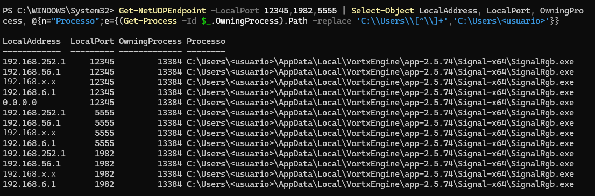
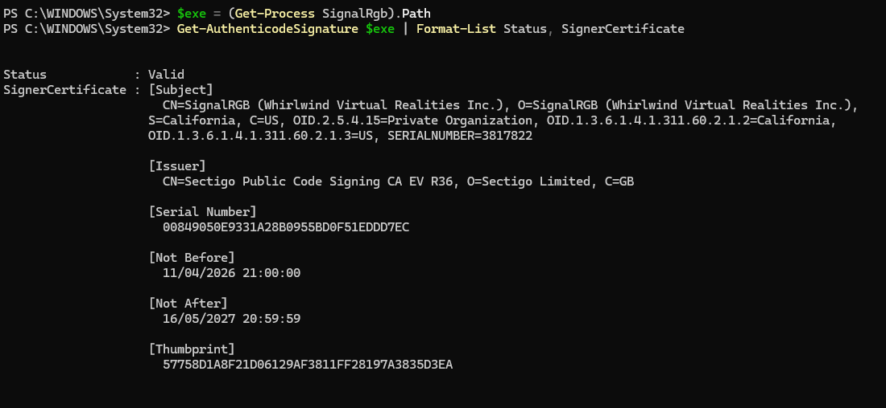

### 3. Primeira correção e um erro meu

Regra de bloqueio **sem log** no topo da WAN, específica para o fluxo. A regra foi criada como **TCP** por engano, e nunca casaria com um broadcast UDP. O erro foi percebido revisando a coluna Protocol na lista de regras.

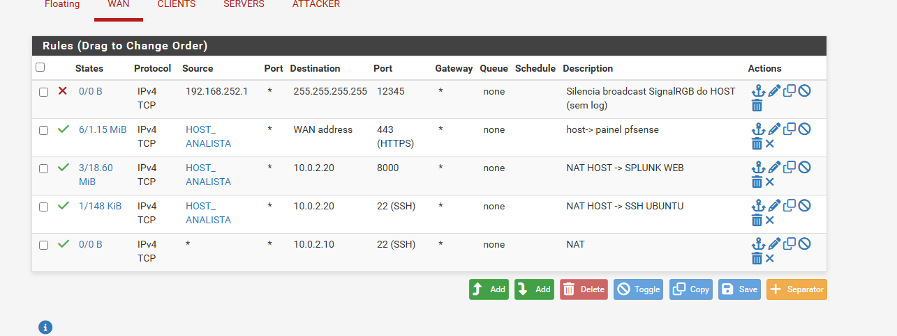

Na mesma revisão, outro achado: a regra NAT do **SSH do DC** estava com origem `*` (qualquer máquina na WAN), não restrita à estação do analista. Corrigida para o alias `HOST_ANALISTA`.

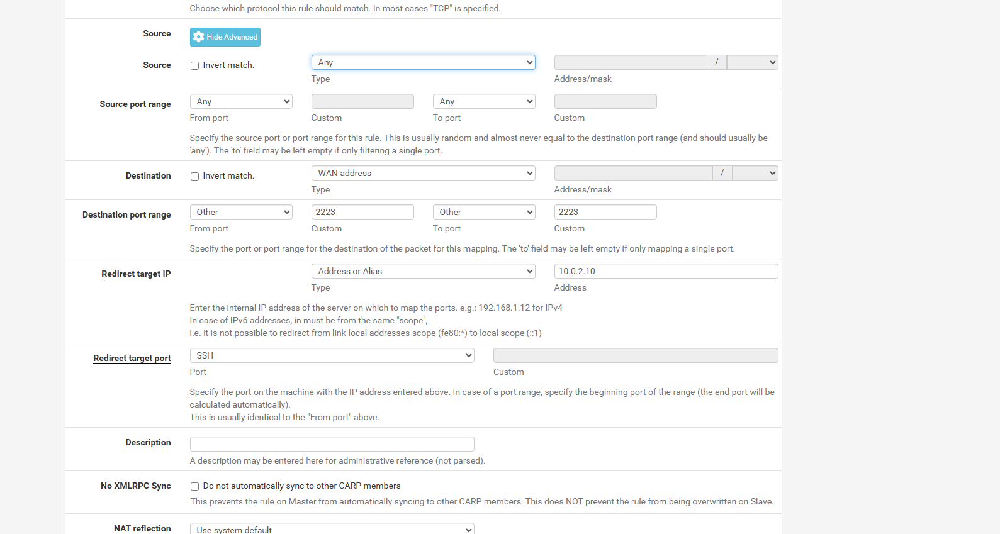

### 4. O volume caiu, mas não zerou

```spl
index=pfsense_logs "255.255.255.255" earliest=-2h
| timechart span=5m count
```

| Janela | Eventos |
|---|---|
| 22:30–22:40 | 40 por janela |
| 22:45 | 19 |
| 22:50 | 6 |

Pergunta certa: **"quando foi o último evento?"**

```spl
index=pfsense_logs "255.255.255.255" earliest=-30m
| stats latest(_time) as ultimo_evento count
| eval minutos_atras=round((now()-ultimo_evento)/60,1)
| convert ctime(ultimo_evento)
```

`minutos_atras = 0.0` → ainda chegavam eventos.

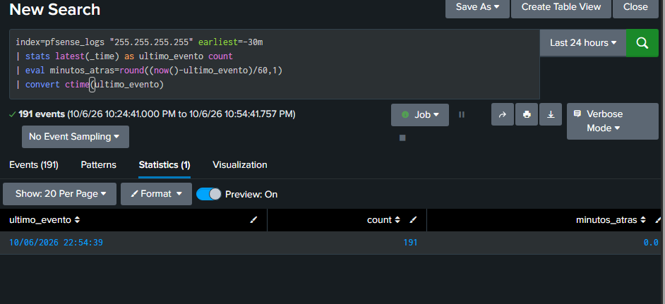

### 5. Decodificando o filterlog

```text
filterlog: 1,6,,1000000103,em0,match,block,in,4,0x0,,128,32816,0,none,17,udp,114,
           192.168.252.1,255.255.255.255,1982,1982,94
```

| Campo | Valor | Significado |
|---|---|---|
| tracker | `1000000103` | Regra de bloqueio padrão (default deny) |
| interface | `em0` | WAN |
| ação | `block` | |
| proto | `udp` | |
| origem → destino | `192.168.252.1 → 255.255.255.255` | HOST, broadcast |
| portas | `1982 → 1982` e `5555 → 5555` | **Outros fluxos**, 1x por minuto |

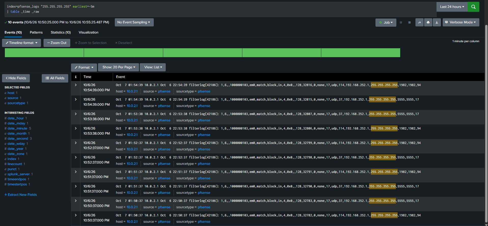

A busca por texto misturava fluxos distintos. A porta 12345 já estava silenciada; restavam 1982 e 5555. Mesmo método, mesma conclusão:

```text
LocalAddress  LocalPort OwningProcess Processo
192.168.252.1      5555         13952 ...\SignalRgb.exe
192.168.252.1      1982         13952 ...\SignalRgb.exe
```

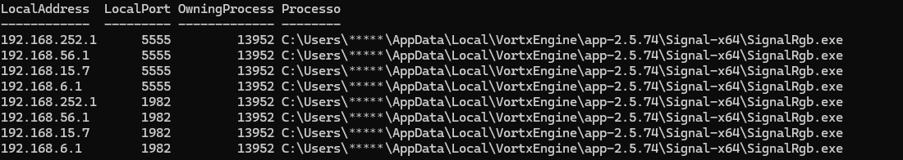

## Correção com alias

Alias de portas, mantendo a exclusão **estreita e documentada**:

| Alias | Portas | Descrição |
|---|---|---|
| `BROADCAST_HOST` | 12345, 1982, 5555 | Portas de descoberta do SignalRGB no HOST |

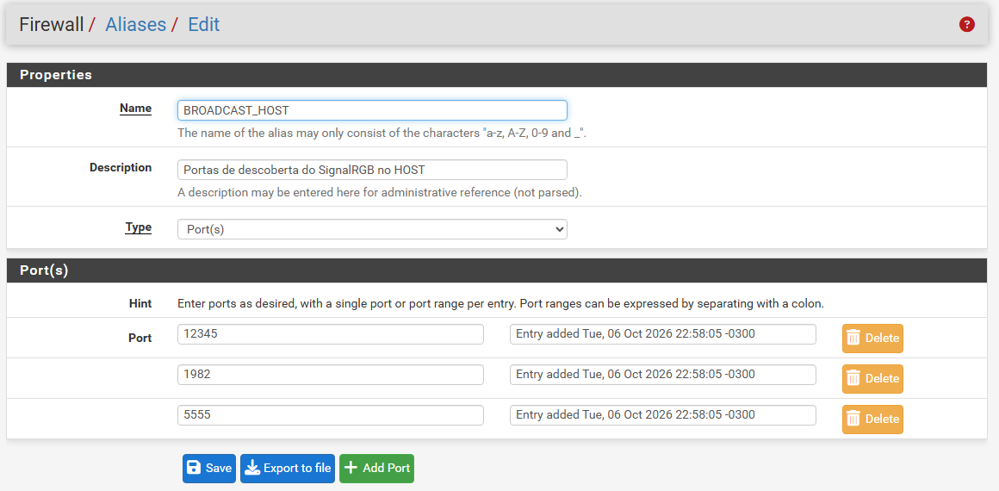

Por que não silenciar todas as portas desse broadcast? Porque uma quarta porta desconhecida **deve gerar log** e ser investigada.

### 6. A correção não tinha sido aplicada de verdade

Ao montar o gráfico final, de 5 em 5 minutos, o volume não chegou a zero: caiu de ~40 para **~10 eventos a cada 5 minutos**, e ficou assim por horas.

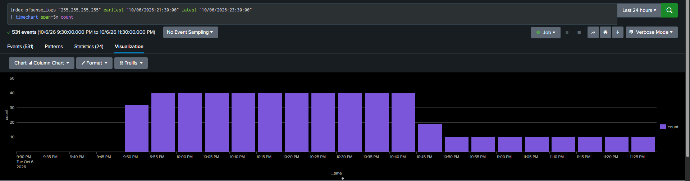

Dez eventos por janela correspondem exatamente aos dois fluxos de uma vez por minuto (1982 e 5555). Extraindo os campos do filterlog na própria busca:

```spl
index=pfsense_logs "255.255.255.255" earliest=-15m
| rex "udp,\d+,(?<src>[\d\.]+),(?<dst>[\d\.]+),(?<sport>\d+),(?<dport>\d+)"
| stats count by src, dst, dport
```

Os eventos ainda caíam no tracker `1000000103` (bloqueio padrão). **Causa:** o alias `BROADCAST_HOST` existia, mas a regra continuava apontando só para a porta `12345`. Criar o objeto não basta: ele precisa ser referenciado na regra.

| Regra final (topo da WAN) | Valor |
|---|---|
| Ação | Block, **sem log** |
| Protocolo | UDP |
| Origem | 192.168.252.1 |
| Destino | 255.255.255.255 : `BROADCAST_HOST` |

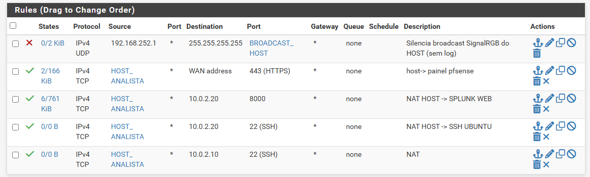

### 7. Validação com teste de controle

1. **Último evento do broadcast:** parou às 01:42:44, minuto em que a regra foi aplicada, e o tempo desde o último evento passou a crescer.
2. **Controle:** um zero só prova algo se o pipeline estiver vivo. No mesmo período, o pfSense continuou enviando outros logs normalmente:

```spl
index=pfsense_logs NOT "255.255.255.255" earliest=-10m
| stats count latest(_time) as ultimo
```

Resultado: 66 eventos em 10 minutos, o mais recente segundos antes da busca. O silêncio era da regra, não de uma falha na coleta.

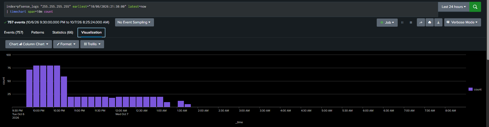

Leitura do gráfico (colunas de 10 minutos): ~80 eventos com as três portas registradas, ~20 depois da primeira regra (só 1982 e 5555) e zero depois do alias. Os vazios por volta de 01:20 e a partir de ~02:00 são períodos com o **laboratório desligado**, por isso não servem, sozinhos, como prova da correção: quem comprova o silêncio é o teste de controle acima.

## Resultado

- Ruído de ~40 eventos a cada 5 minutos removido dos logs do firewall, em duas etapas (a segunda revelada pelo próprio SIEM).
- Todos os demais bloqueios da WAN continuam registrados.
- Achado de segurança paralelo corrigido (SSH do DC exposto a qualquer origem na WAN).

## O que foi aprendido

- **Hipóteses sobre "tráfego conhecido" precisam ser verificadas.** A atribuição ao VMware estava errada.
- Mapear porta → PID → executável → assinatura é o caminho padrão para atribuir tráfego a um processo.
- Revisar a regra **na lista** (não só no formulário) pega erros como TCP/UDP trocado.
- Criar um alias não muda nada até ele ser usado em uma regra.
- Validar a correção **pelo SIEM**, com teste de controle, em vez de presumir que funcionou.
- "Último evento visto" é mais confiável que contagem por janela para confirmar que algo parou.
- Busca por texto livre pode misturar fluxos; o parsing dos campos evita isso (motivo para instalar o add-on do pfSense).
- Um zero no gráfico pode significar "nada aconteceu" ou "nada estava sendo registrado" (lab desligado).

## Limitações e melhorias

- Logs do pfSense ainda sem extração de campos; a análise foi feita lendo o CSV.
- A causa raiz está no HOST; a regra trata o sintoma no lab. Opcional: desativar a descoberta de rede no SignalRGB.
